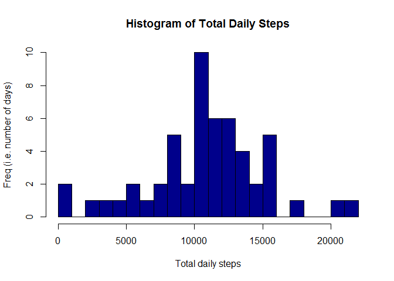
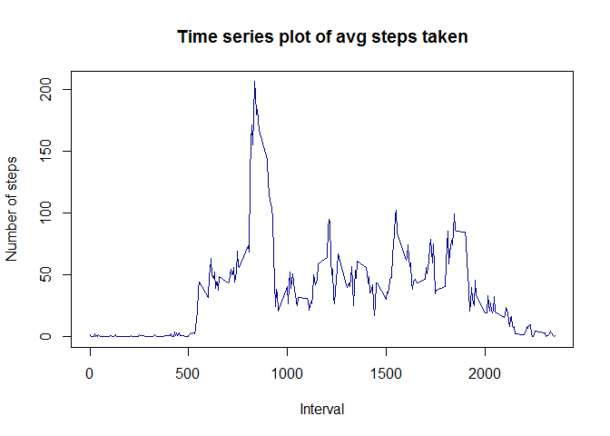
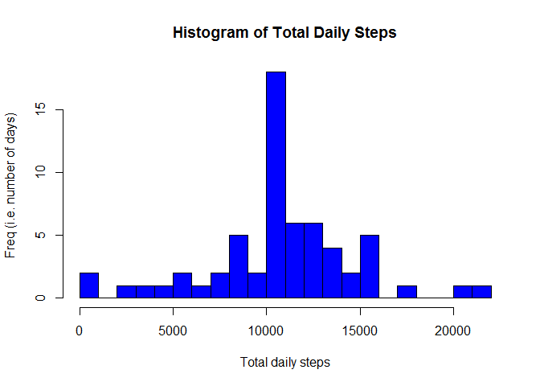

# Reproducible Research: Peer Assessment 1
E.J. Whiley  
September 26, 2016  


#### 1. Loading and preprocessing the data

The data was provided in the Github repo https://github.com/rdpeng/RepData_PeerAssessment1 in the form of a .zip file. The file was downloaded and a .csv file extracted into the working directory for this project.

There are a total of 17,568 observations, and the variables included in the dataset are:

* steps: Number of steps taken in a 5-minute interval (missing values are coded as NA)
* date: The date on which the measurement was taken in YYYY-MM-DD format
* interval: Identifier for the 5-minute interval in which measurement was taken

The first code chunk is to read the data into R and to ensure that all variables are correctly formatted.


```r
df <- read.csv("activity.csv", header=TRUE, sep=",", colClasses = c("steps" = "numeric", "date"="Date", "interval"="numeric"))
```

#### 2.	Histogram of the total number of steps taken each day

Calculate the total number of steps taken per day and display using a histogram. 


```r
##Calculate total steps for each day
dsteps <- aggregate (.~date, data=df[,1:2], sum)

##Plot histogram
hist(dsteps$steps, xlab = "Total daily steps", ylab = "Freq (i.e. number of days)", breaks = 25, main = "Histogram of Total Daily Steps", col="dark blue")
```

<!-- -->

#### 3.	Mean and median number of the total steps taken each day

Calculate and report the mean and median of the total number of steps taken per day.


```r
summary(dsteps)[3:4,2]
```

```
##                                     
## "Median :10765  " "Mean   :10766  "
```

#### 4.	Time series plot of the average number of steps taken

Make a time series plot (i.e. type = "l") of the 5-minute interval (x-axis) and the average number of steps taken, averaged across all days (y-axis)


```r
##Calculate mean steps for each time interval
tsteps <- aggregate (.~interval, data=df[,c(1,3)], mean)

##Plot graph
plot(tsteps$interval, tsteps$steps, xlab="Interval", ylab = "Number of steps", main="Time series plot of avg steps taken", type="l", col="dark blue")
```

<!-- -->

#### 5.	The 5-minute interval that, on average, contains the maximum number of steps

Which 5-minute interval, on average across all the days in the dataset, contains the maximum number of steps?


```r
tsteps[which(tsteps$steps == max(tsteps$steps)),]
```

```
##     interval    steps
## 104      835 206.1698
```


#### 6.	Code to describe and show a strategy for imputing missing data

Calculate and report the total number of missing values in the dataset (i.e. the total number of rows with NAs)

Devise a strategy for filling in all of the missing values in the dataset. The strategy does not need to be sophisticated. For example, you could use the mean/median for that day, or the mean for that 5-minute interval, etc.

Create a new dataset that is equal to the original dataset but with the missing data filled in


```r
## Number of rows with NAs
summary(df)[7,1]
```

```
## [1] "NA's   :2304  "
```

```r
##NAs occur when a complete day of data, rather than selected intervals, is missing
##Replace days with NAs with mean value for each time interval, which is contained in tsteps data frame
temp <- merge(df, tsteps, by="interval", suffixes=c(".df", ".tsteps"))
temp <- temp[order(temp[,3], temp[,1]),]
na.id <- which(is.na(df$steps))
df[na.id, "steps"]<-temp[na.id, "steps.tsteps"]
```


#### 7.	Histogram of the total number of steps taken each day after missing values are imputed

Make a histogram of the total number of steps taken each day

Calculate and report the mean and median total number of steps taken per day. 

Do these values differ from the estimates from the first part of the assignment? 

What is the impact of imputing missing data on the estimates of the total daily number of steps?


```r
##Calculate total steps for each day
dsteps2 <- aggregate (.~date, data=df[,1:2], sum)

##Plot histogram
hist(dsteps2$steps, xlab = "Total daily steps", ylab = "Freq (i.e. number of days)", breaks = 25, main = "Histogram of Total Daily Steps", col="blue")
```

<!-- -->

```r
##Mean and median total number of steps taken per day
summary(dsteps2)[3:4,2]
```

```
##                                     
## "Median :10766  " "Mean   :10766  "
```

The median value differs very slightly from the value in the first part of the assessment but the mean has not moved. Imputing missing data has increased the total number of steps in the data set and has resulted in increased frequency of observations.


#### 8.	Panel plot comparing the average number of steps taken per 5-minute interval across weekdays and weekends

Create a new factor variable in the dataset with two levels - "weekday" and "weekend" indicating whether a given date is a weekday or weekend day.

Make a panel plot containing a time series plot (i.e. type = "l") of the 5-minute interval (x-axis) and the average number of steps taken, averaged across all weekday days or weekend days (y-axis). See the README file in the GitHub repository to see an example of what this plot should look like using simulated data.


```r
df$day <- weekdays(df$date, abbreviate=T)
weekend <- c("Sat", "Sun")
df$daygroup <- factor(with(df, ifelse(day %in% weekend, "weekend", "weekday")))

##Calculate mean steps for each time interval for each of the factor levels
tsteps2 <- aggregate (.~interval+daygroup, data=df[,c(1,3,5)], mean)

library(lattice)
xyplot(steps ~ interval | daygroup, data=tsteps2, type="l", layout=c(1,2), ylab = "Number of steps", xlab="Interval")
```

<!-- -->


#### 9.	All of the R code needed to reproduce the results (numbers, plots, etc.) in the report

All code to produce calculation results and plots is already contained in the steps 1-8.
